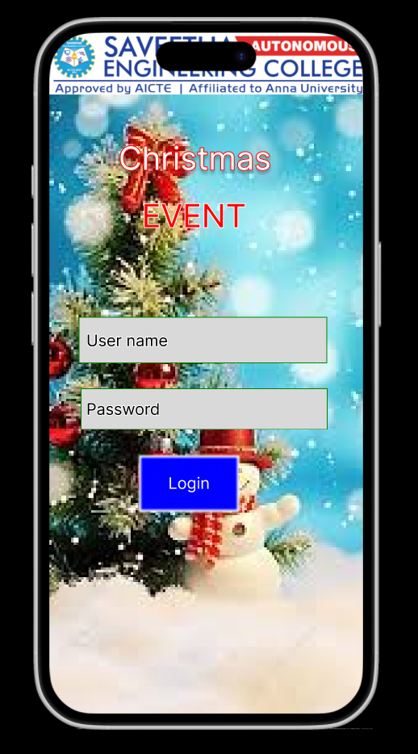
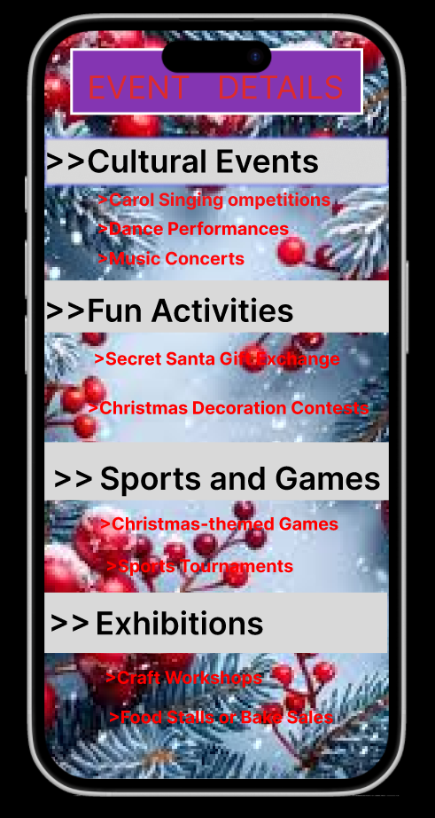
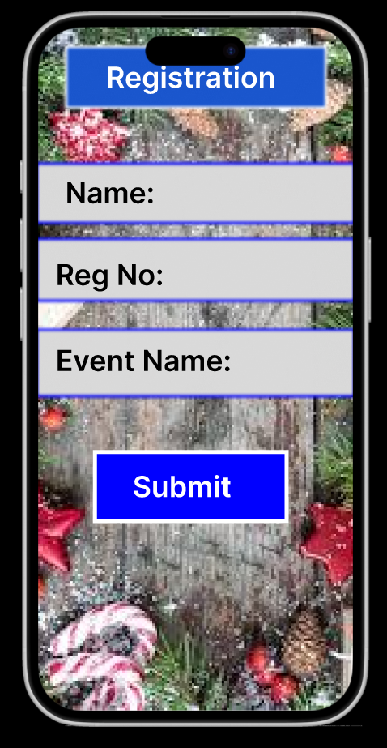
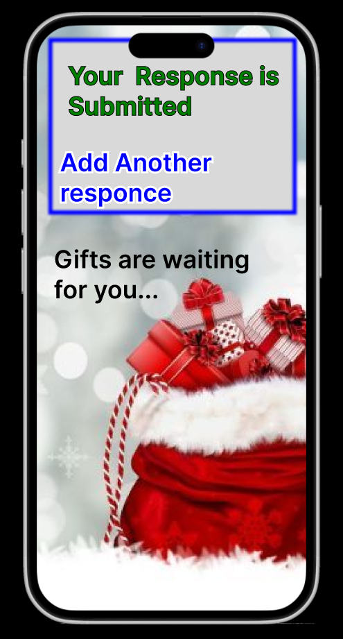

# Ex09 Event Registration Web Application
## Date:19-12-24

## AIM:
To design, develop and deploy a web application for event registration.

## DESIGN STEPS:

### Step 1:
Create a new frame.

### Step 2:
Select any one preset size of your choice.

### Step 3:
Select the shapes you need.

### Step 4:
Import images as needed.

### Step 5:
Create pages based on your need and link them.

### Step 6:

Validate the HTML and CSS code.

### Step 6:

Publish the website in the given URL.

## DESIGN TOOL:
Figma

## CODE:
```
<html>
<head>
    <title>Christmas Event</title>
</head>
<body style="margin: 0; font-family: Arial, sans-serif; background-color: #f2f2f2; color: #000;">

    <!-- Page 1: Login -->
    <div style="width: 100%; max-width: 400px; margin: 20px auto; text-align: center; background: url('background.jpg') no-repeat center center/cover; border-radius: 10px; padding: 20px; color: white;">
        <h2>Christmas EVENT</h2>
        <div style="padding: 10px;">
            <input type="text" placeholder="User name" style="width: 80%; padding: 10px; margin: 10px 0; border: none; border-radius: 5px;">
            <input type="password" placeholder="Password" style="width: 80%; padding: 10px; margin: 10px 0; border: none; border-radius: 5px;">
            <button style="width: 80%; padding: 10px; margin: 10px 0; background: blue; color: white; font-weight: bold; border: none; border-radius: 5px; cursor: pointer;">Login</button>
        </div>
    </div>
```
```
    <!-- Page 2: Event Details -->
    <div style="width: 100%; max-width: 400px; margin: 20px auto; text-align: center; background: url('background.jpg') no-repeat center center/cover; border-radius: 10px; padding: 20px; color: white;">
        <h3 style="color: #d51243;">EVENT DETAILS</h3>
        <div style="margin: 10px 0;">
            <h4>> Cultural Events</h4>
            <p>- Carol Singing Competitions</p>
            <p>- Dance Performances</p>
            <p>- Music Concerts</p>
        </div>
        <div style="margin: 10px 0;">
            <h4>> Fun Activities</h4>
            <p>- Secret Santa Gift Exchange</p>
            <p>- Christmas Decoration Contest</p>
        </div>
        <div style="margin: 10px 0;">
            <h4>> Sports and Games</h4>
            <p>- Christmas-themed Games</p>
            <p>- Sports Tournaments</p>
        </div>
    </div>
```
```

    <!-- Page 3: Registration -->
    <div style="width: 100%; max-width: 400px; margin: 20px auto; text-align: center; background: url('background.jpg') no-repeat center center/cover; border-radius: 10px; padding: 20px; color: white;">
        <h3>Registration</h3>
        <form>
            <input type="text" placeholder="Name" style="width: 80%; padding: 10px; margin: 10px 0; border: none; border-radius: 5px;">
            <input type="text" placeholder="Reg No" style="width: 80%; padding: 10px; margin: 10px 0; border: none; border-radius: 5px;">
            <input type="text" placeholder="Event Name" style="width: 80%; padding: 10px; margin: 10px 0; border: none; border-radius: 5px;">
            <button style="width: 80%; padding: 10px; margin: 10px 0; background: blue; color: white; font-weight: bold; border: none; border-radius: 5px; cursor: pointer;">Submit</button>
        </form>
    </div>
```
```
    <!-- Page 4: Submission Response -->
    <div style="width: 100%; max-width: 400px; margin: 20px auto; text-align: center; background: #fff; border-radius: 10px; padding: 20px; color: green;">
        <h3>Your Response is Submitted</h3>
        <a href="#" style="color: blue;">Add Another Response</a>
        <p>Gifts are waiting for you...</p>
    </div>

</body>
</html>
```
## OUTPUT:




## RESULT:
The program to design, develop and deploy a web application for event registration is completed successfully.
